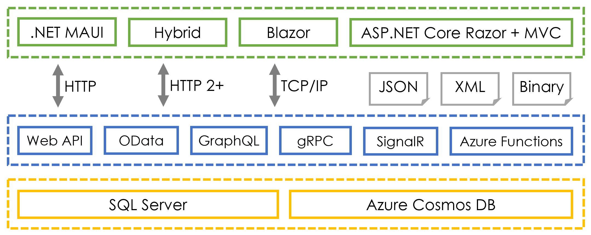

# Apps and Services with .NET 7
Repository for the Packt Publishing book titled "Apps and Services with .NET 7" by Mark J. Price

All of my books on Packt's website: https://subscription.packtpub.com/search?query=mark+j.+price

## Sibling books

[GitHub repository for C# 11 and .NET 7 - Modern Cross-Platform Development Fundamentals](https://github.com/markjprice/cs11dotnet7)

## Technologies covered in the book

## Chapters
- Chapter 1 Introducing Apps and Services with .NET
- Chapter 2 Managing Relational Data Using SQL Server
- Chapter 3 Managing NoSQL Data Using Azure Cosmos DB
- Chapter 4 Benchmarking Performance, Multitasking, and Concurrency
- Chapter 5 Implementing Popular Third-Party Libraries
- Chapter 6 Observing and Modifying Code Execution Dynamically
- Chapter 7 Handling Dates, Times, and Internationalization
- Chapter 8 Protecting Your Data and Applications
- Chapter 9 Building and Securing Web Services with Minimal APIs
- Chapter 10 Exposing Data via the Web Using OData
- Chapter 11 Combining Data Sources Using GraphQL
- Chapter 12 Building Efficient Microservices Using gRPC
- Chapter 13 Broadcasting Real-Time Communication Using SignalR
- Chapter 14 Building Serverless Nanoservices Using Azure Functions
- Chapter 15 Building Web User Interfaces Using ASP.NET Core
- Chapter 16 Building Web Components Using Blazor WebAssembly
- Chapter 17 Leveraging Open-Source Blazor Component Libraries
- Chapter 18 Building Mobile and Desktop Apps Using .NET MAUI
- Chapter 19 Integrating .NET MAUI Apps with Blazor and Native Platforms
- Chapter 20 Introducing the Survey Project Challenge
