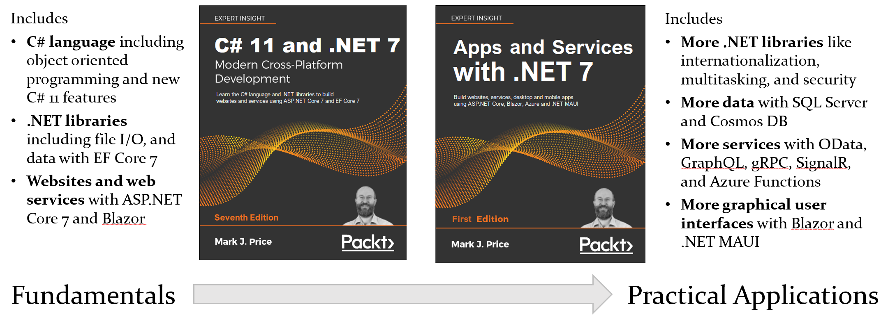

# Apps and Services with .NET 7
Repository for the Packt Publishing book titled "Apps and Services with .NET 7" by Mark J. Price

## Chapters
- Chapter 1 Introducing Apps and Services with .NET
- Chapter 2 Working with Data Using SQL Server
- Chapter 3 Working with Data Using Azure Cosmos DB
- Chapter 4 Improving Performance and Scalability Using Multitasking
- Chapter 5 Using Popular Third Party Libraries (ImageSharp, Serilog, AutoMapper, FluentAssertions, FluentValidation, QuestPDF)
- Chapter 6 Controlling the Roslyn Compiler, Reflection and Expression Trees
- Chapter 7 Handling Dates, Times, and Internationalization
- Chapter 8 Protecting Your Data and Applications
- Chapter 9 Building and Securing Web Services with Minimal APIs
- Chapter 10 Exposing Data via the Web Using OData
- Chapter 11 Combining Data Sources Using GraphQL (using ChilliCream's Hot Chocolate)
- Chapter 12 Building Efficient Microservices Using gRPC
- Chapter 13 Broadcasting Realtime Communication Using SignalR
- Chapter 14 Building Serverless Nanoservices Using Azure Functions
- Chapter 15 Building Web User Interfaces Using ASP.NET Core
- Chapter 16 Building Web Components Using Blazor WebAssembly
- Chapter 17 Using Open Source Blazor Component Libraries
- Chapter 18 Building Mobile and Desktop Apps Using .NET MAUI
- Chapter 19 Implementing Mobile Features Using .NET MAUI
- Chapter 20 Introducing the Survey Project

## Sibling books

[GitHub repository for C# 11 and .NET 7 - Modern Cross-Platform Development](https://github.com/markjprice/cs11dotnet7)