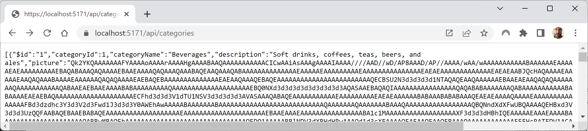
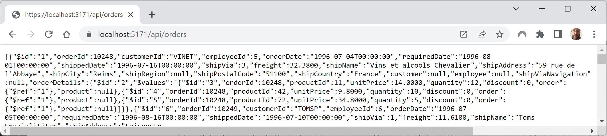
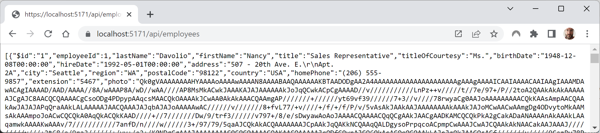

**Improvements** (9 items)

If you have suggestions for improvements, then please [raise an issue in this repository](https://github.com/markjprice/apps-services-net7/issues) or email me at markjprice (at) gmail.com.

- [Page 72 - Executing stored procedures using ADO.NET](#page-72---executing-stored-procedures-using-adonet)
- [Page 81 - Defining the Northwind database model](#page-81---defining-the-northwind-database-model)
- [Page 169 - Nested and child tasks](#page-169---nested-and-child-tasks)
- [Page 232 - Making a type or member obsolete](#page-232---making-a-type-or-member-obsolete)
- [Page 326 - Setting up an ASP.NET Core Web API project](#page-326---setting-up-an-aspnet-core-web-api-project)
- [Page 362 - Building a web service that supports OData](#page-362---building-a-web-service-that-supports-odata)
- [Page 582 - Building and testing a Blazor progress bar component](#page-582---building-and-testing-a-blazor-progress-bar-component)
- [Page 621 - Building a web service for Northwind entities](#page-621---building-a-web-service-for-northwind-entities)
- [Page 634 - Using the Radzen form components](#page-634---using-the-radzen-form-components)

# Page 72 - Executing stored procedures using ADO.NET

> Thanks to [Bob Molloy](https://github.com/BobMolloy) for raising this [issue on 31 December 2022](https://github.com/markjprice/apps-services-net7/issues/3).

In Step 2, I wrote, "In your preferred database tool, add a new stored procedure. For example, if you are using 
SQL Server Management Studio, then right-click Stored Procedures and select Add New Stored Procedure."

It would be better to add an extra step, "In your preferred database tool, add a new stored procedure. For example, if you are using SQL Server Management Studio, then **expand the Programmability node,** right-click Stored Procedures, and select Add New Stored Procedure."

# Page 81 - Defining the Northwind database model

> Thanks to [Bob Molloy](https://github.com/BobMolloy) for raising this [issue on 31 December 2022](https://github.com/markjprice/apps-services-net7/issues/4).

In Step 4, I show text that must be entered as a single line at the command-line, as shown in the following command formatted as in the print book:
```
dotnet ef dbcontext scaffold "Data Source=.;Initial 
Catalog=Northwind;Integrated Security=true;TrustServerCertificate=true;" 
Microsoft.EntityFrameworkCore.SqlServer --output-dir Models --namespace 
Northwind.Console.EFCore.Models --data-annotations --context NorthwindDb
```

I recommend that you type from the print book or copy and paste long commands like this from the eBook into a plain text editor like Notepad. Then make sure that the whole command is properly formatted as a single line with correct spacing, before you then copy and paste it to the command-line. Copying and pasting directly from the eBook is likely to include newline characters and missing spaces and so on that break the command.

For convenience, here is the same command as a single line to make it easier to copy and paste:
```
dotnet ef dbcontext scaffold "Data Source=.;Initial Catalog=Northwind;Integrated Security=true;TrustServerCertificate=true;" Microsoft.EntityFrameworkCore.SqlServer --output-dir Models --namespace Northwind.Console.EFCore.Models --data-annotations --context NorthwindDb
```

# Page 169 - Nested and child tasks

> Thanks to Amer Cejudo for emailing about this item.

In this section about making one task the child of a parent task, I only showed output for one of two possible results, and had two notes to explain the other possible outputs. In the next edition, I will show both possible outputs before and after applying the `AttachedToParent` option.

In Step 3, you run the code and review the result, as shown in the following output:
```
Outer method starting...
Inner method starting...
Outer method finished.
Console app is stopping.
```

As the note at the top of page 170 says, you might not see any output from the `InnerMethod` at all, but I do not show that output. In the next edition, I will include it, as shown in the following output:
```
Outer method starting...
Outer method finished.
Console app is stopping.
```

In Step 4, you add the `AttachedToParent` option. 

In Step 5, you review the result, and the `OuterMethod` could start *and finish* before the `InnerMethod` starts but I do not show this possible output. I only show the scenario where both methods start before the methods finish, as shown in the following output:
```
Outer method starting...
Inner method starting...
Outer method finished.
Inner method finished.
Console app is stopping.
```
The addition of the `AttachedToParent` option means that the `InnerMethod` is guaranteed to both start and end before the console app ends. But it does not guarantee the order in which the methods finish. The `OuterMethod` could finish before the `InnerMethod` starts. Although I had a note about this after my output I did not show the actual output. In the next edition I will include it, as shown in the following output:
```
Outer method starting...
Outer method finished.
Inner method starting...
Inner method finished.
Console app is stopping.
```

# Page 232 - Making a type or member obsolete

> Thanks to [Bob Molloy](https://github.com/BobMolloy) for raising this [issue on 14 January 2023](https://github.com/markjprice/apps-services-net7/issues/8).

Make sure you do not miss the addition of the `{3}` placeholder in the call to `WriteLine`! I will add a note to highlight this in the 8th edition.

# Page 326 - Setting up an ASP.NET Core Web API project

> Thanks to Bob Molloy for emailing me about this issue on 25 January 2023.

In Step 7, I wrote, "Start the website project using the `https` profile (`dotnet run --launch-profile https`) and 
note the Swagger documentation." This sentence was sloppily written and it did not include detailed instructions on how to start a website project or to start the web browser manually if using the command-line. In the next edition I will add more details.

For example, as always with starting a website project, if you use Visual Studio 2022 then it can automatically start a web browser for you if you have configured it to do so using the `launchSettings.json` file, as you did in Step 5, and as shown in the following configuration:
```json
"profiles": {
  ...
  "https": {
    "commandName": "Project",
    "dotnetRunMessages": true,
    "launchBrowser": true,
    "launchUrl": "swagger",
    "applicationUrl": "https://localhost:5091",
    "environmentVariables": {
    "ASPNETCORE_ENVIRONMENT": "Development"
  }
```
But if you start the website project at the command-line then you must manually start a web browser and manually navigate to `https://localhost:5091/swagger`.

# Page 362 - Building a web service that supports OData

> Thanks to Bob Molloy for emailing me about this issue on 5 January 2023.

In Step 3, you add a reference to a project that is outside the solution. In Step 4, you build the project at the command-line or terminal by using the following command: `dotnet build`. 

There is a note to explain that if you try to use the **Build** menu in Visual Studio then you will see an error. This is because Visual Studio cannot find projects that are outside a solution. In early drafts of the book, this was the first time this situation occurred which is why I put the note here. In later drafts, the SQL Server and Cosmos DB chapters were moved earlier. So then the first time the situation occurs is in Chapter 3 on page 130. In the next edition I will move the note to the first time the situation occurs.

# Page 582 - Building and testing a Blazor progress bar component

In Step 6, I wrote, "In `App.razor`, comment out the `<FocusOnNavigate>` element so that the `<h1>` is not selected". 

In the GA release, Microsoft improved this feature so that the `<h1>` element does not have an ugly outline when it has the focus, as shown in the following CSS file:
```css
h1:focus {
    outline: none;
}
```

In the next edition, I will remove Step 6. The same applies to the section *Enabling the Radzen dialog, notification, context menu, and tooltip components* on page 615 in Step 4. 

# Page 621 - Building a web service for Northwind entities

In Step 6, I give instructions to write statements to configure two endpoints for an HTTP API web service that return categories and their related products, and to return orders. In the next edition, I will add steps to test that they work:

7. Start the `Northwind.BlazorLibraries.Server` project without debugging.
8. In the browser address box, enter the path to request categories, as shown in the following link: https://localhost:5171/api/categories, and note the response as shown in the following screenshot:



9. In the browser address box, enter the path to request orders, as shown in the following link: https://localhost:5171/api/orders, and note the response as shown in the following screenshot:



# Page 634 - Using the Radzen form components

In Step 1, I give instructions to write statements to configure four endpoints for an HTTP API web service that return employees, cities, and countries, and to update an employee. 

In the next edition, I will add steps to test that they work:

a) Start the `Northwind.BlazorLibraries.Server` project without debugging.
b) In the browser address box, enter the path to request employees, as shown in the following link: https://localhost:5171/api/employees, and note the response as shown in the following screenshot:



c) In the browser address box, enter the path to request countries, as shown in the following link: https://localhost:5171/api/countries, and note the response as shown in the following output:
```
["UK","USA"]
```
d) In the browser address box, enter the path to request cities, as shown in the following link: https://localhost:5171/api/cities, and note the response as shown in the following output:
```
[null,"Kirkland","London","Redmond","Seattle","Tacoma"]
```
